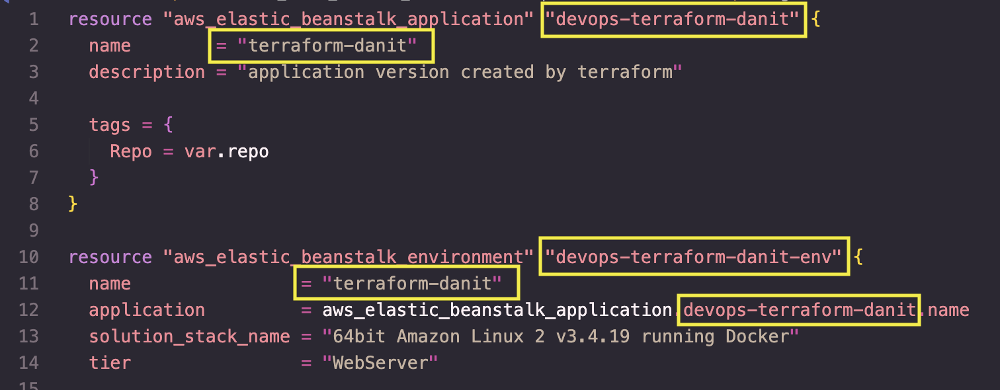

# Aplicação em Terraform para subir o recurso do Elastic Beanstalk - AWS 

---

Olá pessoal, aqui eu fiz um projeto simples para subir um Elastic Beanstalk via Terraform.

Deixarei o link da minha aplicação que já é possível de ser acessada: 
**_[Site Hello World](http://terraform-danit.eba-cpm5spqi.us-east-1.elasticbeanstalk.com/)_**

Existem alguns erros no meu código, como por exemplo deixar o nome do aplicativo "chumbado", por não ser uma boa prática, eu considero um erro mas pretendo melhorar isso durante os ajustes.

No arquivo **_[elasticbeanstalk.tf](https://github.com/danitorelli/terraform/blob/main/elasticbeanstalk.tf"elasticbeanstalk.tf")_** eu coloquei alguns parâmetros necessários para subir a aplicação.

Caso você queira modificar o nome da sua aplicação, você tem que alterar nos lugares circulados em amarelo:

<div align="center">
    
</div>


---

### Para subir essa aplicação, você deve clonar esse repositório:


```sh
$ git clone https://github.com/danitorelli/terraform.git
```

Com o repositório clonado, abra seu editor de texto de preferência e digite:

```sh
$ terraform init
```
Para garantir que todos os arquivos estejam identados, digite:

```sh
$ terraform fmt
```

feito isso, podemos ver qual será o plano de execução, digitando:

```sh
$ terraform plan
```
Estando tudo ok, podemos aplicar nossas modificações:
```sh
$ terraform apply
```

Após alguns minutos sua aplicação estará no ar, basta abrir seu painel da AWS na página do Elastic Beanstalk, e acessar a URL que ele nos forneceu!


OBS: O repositório do código Hello World e do deploy está aqui:

**_[Repositório Hello World](https://github.com/danitorelli/devops-elasticbeanstalk)_**
